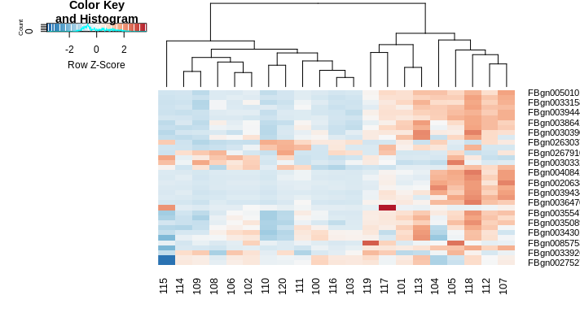

# Advanced Informatics

This repo is for week 9 lab for Advanced Informatics 283.

[Home](https://github.com/Javelarb/Advanced_Informatics_2021)

The code for DESeq went smoothly, although I had to modify some of it because I used different samples.  
I did samples 100-120 on the RNA Seq experiment.  
These samples did not have different tissue sites (They were all "E").  
I performed the differential abundance analysis on the plate column as a result.  
I also had to change the gsub expression since I did not use your code to generate the sample names.  
I used the `RNAseq384_SampleCoding.txt` file as the metdata.  

The SCGB code also worked.  
This is the link for my hosted ATACseq genome.  

https://data.cyverse.org/dav-anon/iplant/home/julya/P004.RG.bam.bw
